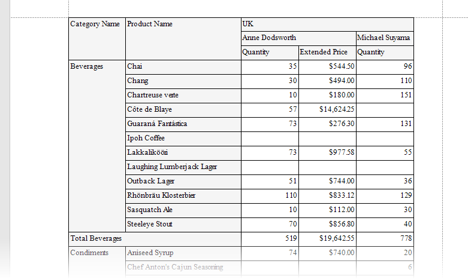

# How to Use the XRCrossTab Control to Create a Cross-Tab Report in Code

The following example demonstrates how to use the [Cross Tab](https://docs.devexpress.com/XtraReports/DevExpress.XtraReports.UI.XRCrossTab?v=21.2) control to generate a [cross-tab report](https://docs.devexpress.com/XtraReports/4226?v=21.2) in code.

In this solution, [SqlDataSource](https://docs.devexpress.com/CoreLibraries/DevExpress.DataAccess.Sql.SqlDataSource?v=21.2) is used as an XRCrossTab data source.

See also:
* [Bind a Report to a Database](https://docs.devexpress.com/XtraReports/2554?v=21.2)

